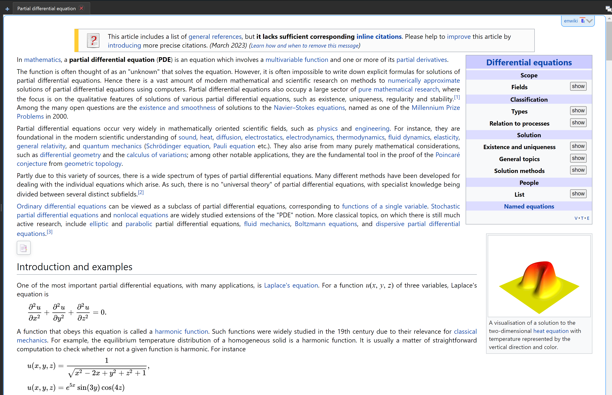
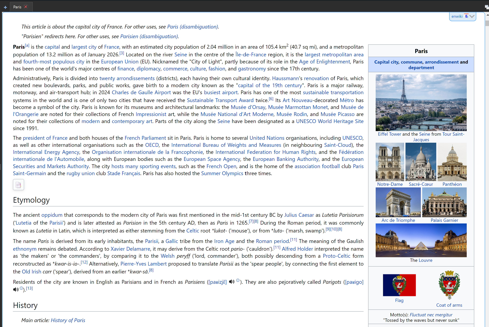
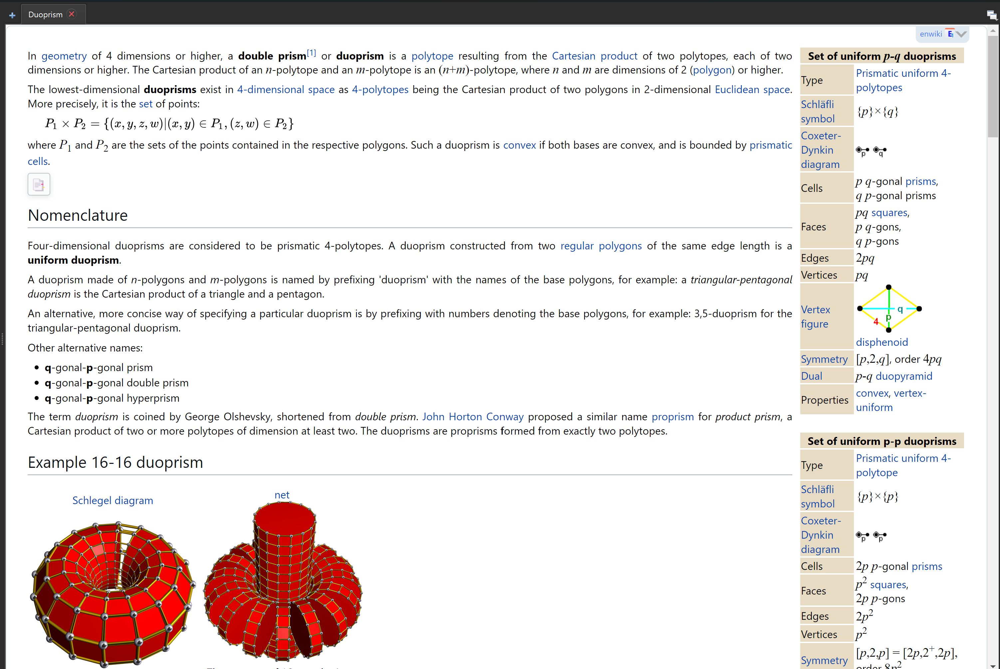
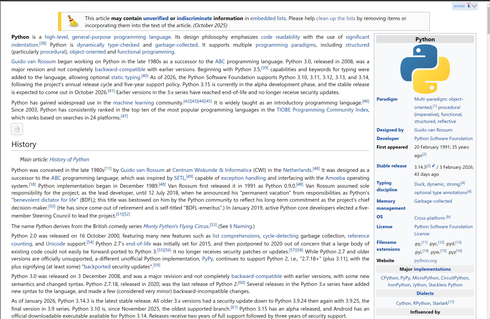

# Wikipedia / Wiktionary Dump Processor

A parallel Python pipeline that converts Wikipedia and Wiktionary `.tar.gz` HTML dumps into [MDX](https://www.mdict.cn/) dictionary files ready for use in offline dictionary apps (e.g. MDict, GoldenDict).

Processes the full English Wikipedia dump — roughly 500 GB of uncompressed HTML — in around 5 hours on a 16-core laptop with 32 GB RAM, including ~130 minutes for parallel HTML processing and ~100 minutes for the DuckDB deduplication step.

## Features

- **Multi-project support** – works with `wiki` (Wikipedia) and `wiktionary` (Wiktionary) dumps
- **Multi-language support** – English (`en`) and French (`fr`) out of the box; easily extensible
- **Parallel processing** – distributes work across CPU cores via Python `multiprocessing`
- **Efficient decompression** – uses `indexed-gzip` + `rapidgzip` to seek directly into large `.gz` archives without full extraction
- **DuckDB-backed intermediate storage** – binned NDJSON files are deduped and merged with DuckDB for low memory overhead
- **MDX output** – produces `.mdx`, `.css`, `.js`, and module files consumable by MDict-compatible readers

Note: Due to the large size of the resulted MDict txt, it is advised to use this multithreaded [version](https://github.com/leanhdung1994/mdict-utils) of `mdict-utils`.

## Screenshots

<p align="center">
  
&nbsp; &nbsp; &nbsp; &nbsp;
  
</p>
<p align="center">
  
&nbsp; &nbsp; &nbsp; &nbsp;
  
</p>

## Usage

```bash
python main.py \
  --proj wiktionary \       # wiki | wiktionary
  --lang en \               # en | fr
  --input-dir  /path/to/dumps \
  --output-dir /path/to/output \
```

### Optional flags

| Flag | Default | Description |
|------|---------|-------------|
| `--core N` | 70 % of CPUs | Number of worker processes |
| `--chunk N` | `0` (all) | Batch size in NDJSON files per core (0 = unlimited) |
| `--bufsize MB` | `512` | RAM buffer before flushing to disk |
| `--debug` | off | Process only the first 2 NDJSON files (1000 lines each) |
| `--mode MODE` | `greedy` | HTML pruning depth: `greedy` strips optional sections (translations, derived terms, etc.); other values retain them |

## Pipeline overview

```
tar.gz dump
      │
      ▼
initial_setup
      │   Build gzip seek index, list NDJSON members,
      │   initialise progress log
      ▼
parallel_processor
      │   Parse HTML with selectolax across N cores,
      │   write hash-binned NDJSON files {prefix}_bin_0.ndjson … {prefix}_bin_N.ndjson
      ▼
parquet_collector
      │   Deduplicate per bin — keep latest dateModified per identifier,
      │   export {prefix}_bin_0.parquet … {prefix}_bin_N.parquet
      ▼
txt_and_modules_collector
      │   Merge all bins → .txt (MDX-formatted HTML entries),
      │   export module URLs → {prefix}_modules.parquet
      ▼
css_and_js_collector
      │   Collect unique modules from parquet, fetch CSS from
      │   live wiki in batches, bundle local JS assets
      ▼
mdx_collector
      │   Invoke mdict to produce final .mdx
      ▼
.mdx + .css + .js
```

## Project structure

```
src/
├── main.py                      # Entry point & CLI
├── config.py                    # Config dataclass & shared imports
├── initial_setup.py             # Dump indexing
├── parallel_processor.py        # Multiprocessing orchestration
├── ndjson_processor.py          # Per-file NDJSON process
├── html_processor.py            # HTML cleaning with selectolax
├── parquet_collector.py         # DuckDB dedupe
├── txt_and_modules_collector.py # Headword & modules export
├── css_and_js_collector.py      # CSS/JS bundling
├── mdx_collector.py             # MDX packaging
├── css_js/                      # Extract CSS & JS
│   ├── common.css / common.js
│   ├── wiki.css / wiki.js
│   ├── wiktionary.css / wiktionary.js
│   └── frwiki.js
└── requirements.txt
```

## Architecture

This pipeline was built to handle Wikipedia/Wiktionary dumps that can reach hundreds of gigabytes. Several deliberate design decisions make it fast, memory-efficient, and resumable.

---

### Zero-extraction parallel I/O via indexed gzip seeking

Workers never decompress the full `.tar.gz` archive to disk. Instead, `initial_setup.py` builds a seek index once using `rapidgzip`, and each worker process opens the archive directly via `indexed-gzip`, jumping straight to its assigned NDJSON member by byte offset.

---

### Producer / consumer decoupling with a bounded queue

The worker pool and the disk writer run on completely separate threads. Workers push `(bin, data, size, status)` tuples into a `Queue(maxsize=n_cores × 4)`; a single dedicated writer thread drains it and handles all disk I/O.

---

### Hash-based binning eliminates merge-time shuffling

Every parsed entry is routed to a bin by `identifier % n_bins`, where `n_bins = 3 × len(ndjson_files)`. Because entries with the same `identifier` always land in the same bin, the deduplication step (keep only the most recent `dateModified` per article) runs independently on each bin with zero cross-bin coordination.

---

### In-memory write buffering with per-bin accounting

The writer maintains a separate byte buffer for each bin and only flushes to disk when the per-bin threshold (`buffer_size / n_bins`) is exceeded. This converts millions of tiny per-entry writes into a handful of large sequential appends per bin.

---

### DuckDB as the merge and deduplication layer

Rather than custom Parquet logic, all merging, deduplication, and export is delegated to DuckDB with plain SQL. DuckDB handles:

- Memory limits (capped at 80 % of available RAM, detected at runtime via `psutil`)
- Spill-to-disk via a configurable temp directory
- Multi-threaded execution across all cores

---

### Resumable progress log

After each batch, the pipeline writes a JSON log that records which NDJSON files have been processed and how long each took. On restart, already-completed files are skipped automatically. The `--chunk` flag also lets you process a large dump in user-defined batches.

---

### Declarative, data-driven HTML and JS pruning

All HTML cleaning rules live in a single data structure (`CSS_selectors` in `html_processor.py`) — nested dicts of CSS selectors keyed by project, language, and parse mode. The `prune_tree()` method simply assembles the right selector list and calls `decompose()`. Adding support for a new language or stripping a new section requires only a data edit, not code changes. The same pattern applies to JavaScript-side section hiding in `JS_selectors` of `css_and_js_collector.py`.

---

### CSS modules collected lazily from live article content

Rather than hard-coding Wikimedia CSS module names, the pipeline extracts the actual `load.php?modules=…` URL embedded in each parsed article, streams all module URLs out of DuckDB, deduplicates them, then fetches the unique modules in batches of 20.

---

### Fault-tolerant entry processing and debug mode

Individual entry failures never abort a worker or stall the pipeline. Each entry is processed inside a `try/except`; any exception is printed for immediate visibility, and the raw JSON line is collected. Once an NDJSON file is fully processed, any failed lines are written out together to a `failed_{prefix}_{ndjson_name}` sidecar file in the output directory. The `--debug` flag complements this by limiting processing to the first 2 NDJSON files, making it fast to validate the full pipeline end-to-end on a small slice of real data.

---

## Acknowledgement

Many thanks to LE Quynh Anh for encouragement and support.
